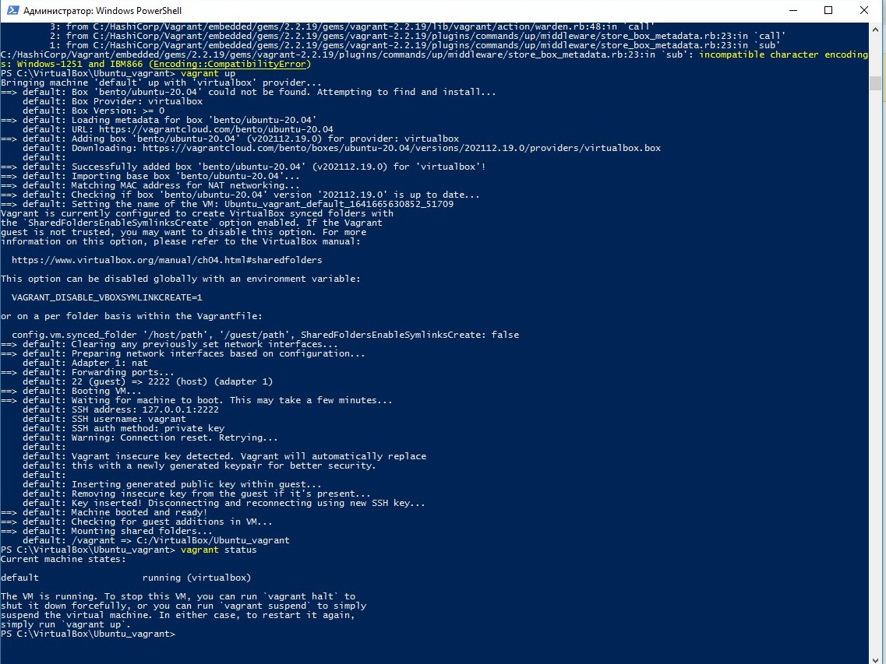
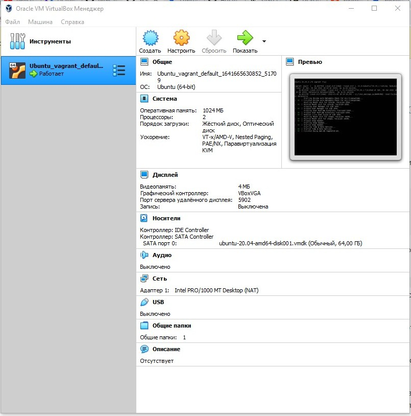
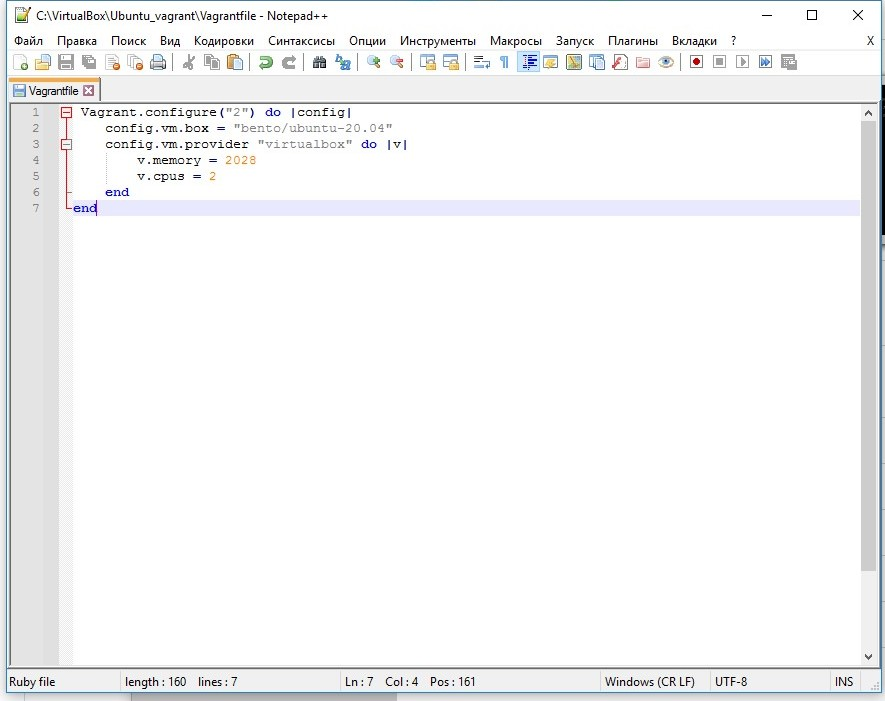
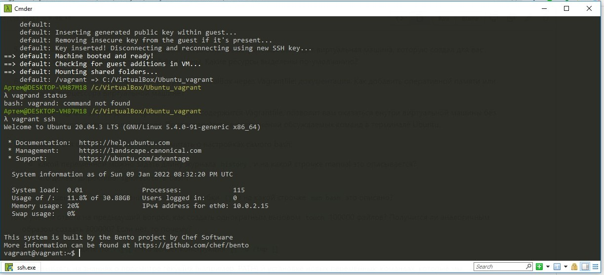

## Домашнее задание к занятию "3.1. Работа в терминале, лекция 1

1. выполнено
2. выполнено
3. выполнено
4. 
5. 
6. Как добавить оперативной памяти или ресурсов процессора виртуальной машине? - путем изменения в Vagrantfile строчек:
   
7. 
8. после команды `vagrant ssh` заходим в мануал - `man bash`, для поиска по страницам мануала использовал команду "/keyword" и кнопку "n" для перемещения по найденныи словам.

   - HISTFILESIZE - строка 690, HISTSIZE - строка 703
   - Если список значений включает в себя ignorespace, строки, начинающиеся с символа пробела, не сохраняются в списке истории. Значение ignoredups приводит к тому, что строки, соответствующие предыдущей записи истории, не сохраняются. Значение ignoreboth является сокращением для ignorespace и ignoredups.
9. BASH_SOURCE - Переменная массива, членами которой являются имена исходных файлов, где соответствующие имена функций оболочки в переменной массива FUNCNAME определены. Иначе говоря - цикличное выполнение команд.
10.

```
touch {1..100000}.txt
```

300000 создать не получится, это слишком дилинный список аргументов

11. проверяет условие у "-d /tmp" - наличие катаолга /tmp
12.

```
    vagrant@vagrant:~$ type -a bash
    bash is /usr/bin/bash
    bash is /bin/bash
    vagrant@vagrant:~$ mkdir /tmp/new_path_directory/
    vagrant@vagrant:~$ cp /bin/bash /tmp/new_path_directory/
    vagrant@vagrant:~$ PATH=/tmp/new_path_directory/:$PATH
    vagrant@vagrant:~$ type -a bash
    bash is /tmp/new_path_directory/bash
    bash is /usr/bin/bash
    bash is /bin/bash
    vagrant@vagrant:~$
```

13. 
at - команда запускается в указанное время (в параметре)
batch - запускается когда уровень загрузки системы снизится ниже 1.5.
